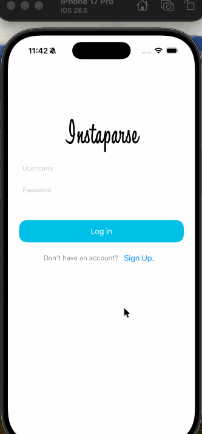

# COP 4655 lab2-bboedy2025
Mobile App Projects Codepath Lab2  
Brady Boedy  
Z23817346

## Instaparse - PT 1

### App Description

The Instaparse app is an app created to mimic basic featuers of instagram. users can choose to either sign up or log into their account. Once created, they then have the option to post a photo from their camera roll with a caption of their choice. 

### App Walk-through

 

### Required Features

- [x] 1. Users can sign up to create a new account.  
- [x] 2. Users can log in after creating an account.  
- [x] 3. Users are able to log out  
- [x] 4. Users are able to persist their login credentials on multiple app launches   
- [x] 5. Users can create a Post by choosing an existing photo from their photos library and uploading it with a caption to the server.  
        - Note: We will modify this to use the camera in the next unit.  
 - [x] 6. Users can view posts they've created in their feed.

